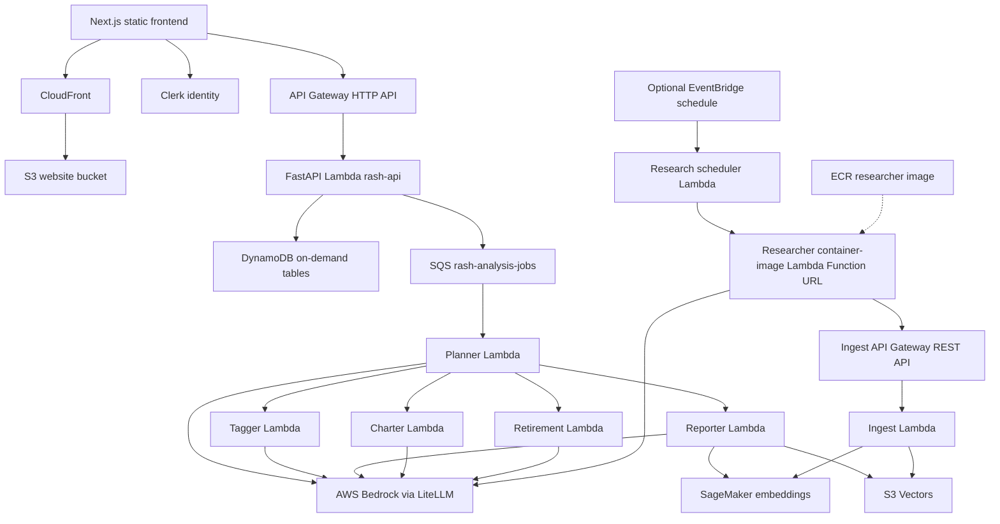
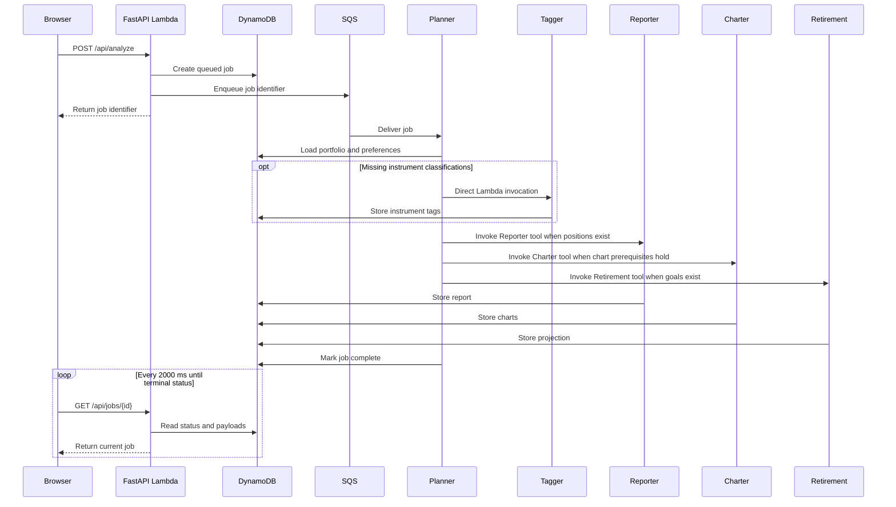

# Rash

Rash turns an equity portfolio into coordinated analysis, visual explanations, and retirement projections.

Live: <https://d27voe79zmvxyl.cloudfront.net>

## What Rash does

Rash gives an investor one place to record accounts, cash, and positions, then understand how those holdings work together. It separates each user’s data while presenting totals, allocation, risk, and goals in a compact financial ledger.

When an analysis is requested, a coordinating agent delegates focused work to specialist agents. The result is a narrative portfolio report, themed charts, and a retirement projection that can be reviewed from the browser.

## Capabilities

- Manage accounts, positions, balances, and preferences through the portfolio subsystem.
- Classify instruments and allocation exposure with the Tagger agent.
- Produce narrative portfolio analysis with the Reporter agent.
- Generate chart specifications with the Charter agent.
- Model retirement readiness with the Retirement agent.
- Coordinate specialist work and persist results with the Planner agent.
- Build and retrieve current market research through the Researcher and vector knowledge pipeline.

## Technology stack

| Layer | Technology | Owner |
| --- | --- | --- |
| Frontend | Next.js 15 Pages Router, React 19, Tailwind CSS v4, static export | `frontend/` |
| Identity | Clerk sessions and bearer tokens | `frontend/`, `terraform/stacks/frontend` |
| Edge delivery | CloudFront and S3 | `terraform/stacks/frontend` |
| Application API | FastAPI on Lambda behind API Gateway HTTP API | `backend/api`, `terraform/stacks/frontend` |
| Agent runtime | OpenAI Agents SDK on Lambda, coordinated through SQS | `backend/planner`, `backend/tagger`, `backend/reporter`, `backend/charter`, `backend/retirement`, `terraform/stacks/agents` |
| Model access | LiteLLM over Amazon Bedrock | agent and researcher directories |
| Research service | ECR container-image Lambda with a public Function URL | `backend/researcher`, `terraform/stacks/researcher` |
| Vector storage | S3 Vectors, index `financial-research` | `backend/ingest`, `terraform/stacks/ingestion` |
| Embeddings | SageMaker Serverless endpoint `rash-embedding-endpoint` | `terraform/stacks/sagemaker` |
| System of record | DynamoDB on-demand tables | `backend/database`, `terraform/stacks/database` |
| Infrastructure and packaging | Terraform, Docker, and uv | `terraform/`, `backend/`, `scripts/` |

## System architecture

The browser receives a static application through CloudFront. Authenticated API requests reach a FastAPI Lambda, which reads and writes DynamoDB and places analysis requests on SQS. The Planner consumes those requests and coordinates the specialist agents. A separate research path builds the vector knowledge base used by the Reporter.



The diagram contains two independent API Gateways. The HTTP API in `terraform/stacks/frontend` carries a Clerk bearer token that the FastAPI Lambda verifies. The REST API in `terraform/stacks/ingestion` protects `POST /ingest` with an API key and usage plan. The API and agent Lambdas access DynamoDB through IAM-scoped table and index permissions.

### Request path

Static assets follow `browser → CloudFront → S3`. Application requests follow `browser → HTTP API → FastAPI Lambda → DynamoDB`. Starting analysis inserts a job, sends its identifier to `rash-analysis-jobs`, and returns immediately to the browser.

### Agent collaboration



The Planner invokes the Tagger directly as a preparation step. Reporter, Charter, and Retirement are tools exposed to the Planner model and are called only when their preconditions hold. The Reporter is the only analysis agent that queries SageMaker and S3 Vectors.

The advisor page obtains status by polling `GET /api/jobs/{id}` every 2000 ms. It clears the interval when the job completes or fails.

## Frontend design system

The “Ruled Ledger” interface defines semantic color, type, spacing, radius, elevation, and motion tokens in `frontend/styles/globals.css`. Components reference interface roles instead of color literals, and saturated color is reserved for positive, negative, warning, and agent meaning.

Light and dark values resolve through the same classes under the document’s `data-theme` attribute. A pre-paint script applies the stored or system preference before first paint, while React hydrates with stable light-theme markup and adopts the applied theme after mount.

Reusable controls live in `frontend/components/ui/`. Chart and Clerk adapters read the same theme tokens, so SVG charts and authentication surfaces follow the active theme. The redesign adds no dependency or development-dependency entry to `frontend/package.json`.

[docs/DESIGN_SYSTEM.md](docs/DESIGN_SYSTEM.md) records the method behind the direction and the encoded scales; `frontend/styles/globals.css` transcribes those values into the token layer.

## Local development

| Prerequisite | Purpose |
| --- | --- |
| Node.js 20+ and npm | Frontend development and static export |
| uv | Every Python directory is an independent uv project |
| Docker Desktop | Linux-compatible Lambda and researcher packaging |
| Terraform 1.11+ | Independent infrastructure stages; S3-native state locking (`use_lockfile`) |
| AWS CLI | Deployment and diagnostics |
| Clerk application | Local and deployed authentication |

Install and run the frontend:

```bash
cd frontend
npm install
npm run dev
```

Run the frontend and FastAPI service together from the scripts uv project:

```bash
cd scripts
uv run run_local.py
```

Run Python only from the uv project that owns the script:

```bash
cd backend/reporter
uv run test_simple.py
```

`terraform/stacks/bootstrap` is a separate first-run step. It creates the S3
bucket that holds every other stack's state, so it keeps local state itself and
takes no `backend.hcl`:

```bash
cd terraform/stacks/bootstrap
terraform init
terraform apply
terraform output state_bucket
```

Every other stack then needs its own `terraform.tfvars`, copied from
`terraform.tfvars.example`, and its own `backend.hcl`, copied from
`backend.hcl.example` and pointed at that bucket:

```bash
cd terraform/stacks/agents
terraform init -backend-config=backend.hcl
terraform plan
terraform apply
```

## Deployment

Apply stacks in dependency order. Each stack has its own state and can be managed independently.

| Stage | Creates |
| --- | --- |
| `terraform/stacks/sagemaker` | Serverless embedding endpoint |
| `terraform/stacks/ingestion` | Ingest Lambda, API-key REST API, and vector integration |
| `terraform/stacks/researcher` | ECR image repository, researcher Lambda Function URL, optional schedule |
| `terraform/stacks/database` | DynamoDB on-demand tables |
| `terraform/stacks/agents` | SQS and five analysis-agent Lambdas |
| `terraform/stacks/frontend` | FastAPI Lambda, HTTP API, S3 website bucket, CloudFront |
| `terraform/stacks/observability` | CloudWatch dashboards and monitoring |

`scripts/deploy.py` applies the frontend stage, builds the static export, and uploads it to S3. It invalidates CloudFront when it can resolve the distribution ID; otherwise it completes the S3 sync and instructs the operator to invalidate the distribution manually. `scripts/destroy.py` coordinates teardown. Review the AWS billing console regularly; DynamoDB uses on-demand request billing and has no provisioned idle throughput.

## Repository layout

| Path | Function |
| --- | --- |
| `frontend/` | Static Next.js application and Ruled Ledger design system |
| `backend/` | API, agents, researcher, ingestion, scheduler, and shared database code; one uv project per working directory |
| `terraform/` | Reusable modules and independently deployable stacks, one remote state file each |
| `scripts/` | Cross-repository local run, deployment, validation, and teardown operations |
| `assets/` | Repository documentation imagery |

## Documentation

| Document | Contents |
| --- | --- |
| [docs/ARCHITECTURE.md](docs/ARCHITECTURE.md) | System architecture, service topology, and data flow |
| [docs/AGENT_ARCHITECTURE.md](docs/AGENT_ARCHITECTURE.md) | How the five agents collaborate, and the orchestration path |
| [docs/DEPLOYMENT.md](docs/DEPLOYMENT.md) | Full-stack deploy runbook, verification toolkit, and the artifact-drift failure mode |
| [docs/FRONTEND_DEPLOY.md](docs/FRONTEND_DEPLOY.md) | Frontend-only build, upload, and cache-invalidation procedure |
| [docs/DESIGN_SYSTEM.md](docs/DESIGN_SYSTEM.md) | Method for deriving the visual direction, the Ruled Ledger token values, and the originality checklist |
| [docs/TROUBLESHOOTING.md](docs/TROUBLESHOOTING.md) | Resolved production issues with root causes, false leads, and evidence |

Infrastructure is applied stack by stack in dependency order; see
[terraform/README.md](terraform/README.md) for the stack layout and first-time
setup, and [docs/DEPLOYMENT.md](docs/DEPLOYMENT.md) for the full deploy and
verification procedure.
